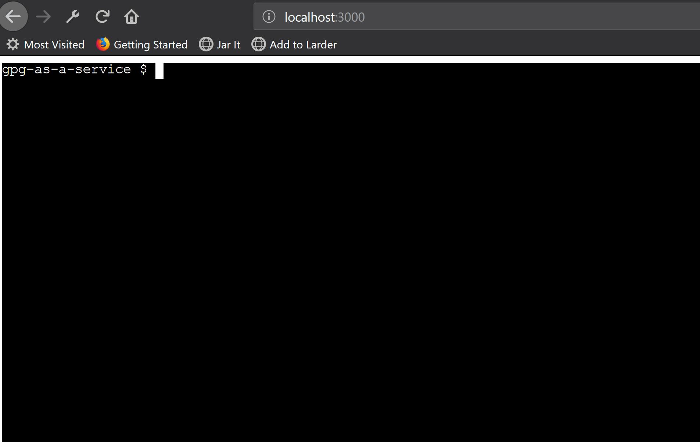

To run the server you'll need to clone this repository and run `npm i && ./node_modules/.bin/tsc . && node app.js`. If that last stepped worked then visiting localhost on port 3000 will present you with a shell that you can interact with as you would with a regular shell.

See the following post for motivation: https://dev.to/davidk01/ptyjs--xtermjs--shell-in-your-browser-1f9c.

